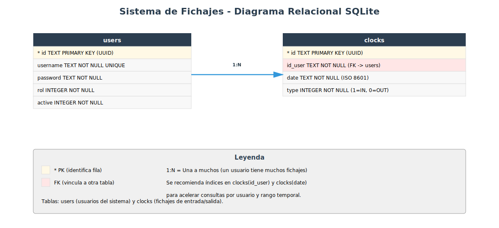

# Diseño de tablas SQLite para Sistema de Fichajes

Este documento te guía paso a paso para transformar tu proyecto de almacenamiento en memoria (diccionarios de Python) a una **base de datos SQLite persistente**. El objetivo es que entiendas qué tablas necesitas crear, por qué están diseñadas así y cómo escribir el SQL.

Como referencia, puedes consultar cómo se hizo esta misma transición en el proyecto modelo de la expendedora (`modelo/cepy_pd4/proyecto/04-sqlite/expendedora/`).


## Fase 1: Identificar las entidades y sus atributos

**User** (`domain/entities/user.py`)

| Atributo | Tipo en Python | Tipo en SQL | Notas |
|---|---|---|---|
| `id` | str (UUID) | TEXT | Identificador único |
| `username` | str | TEXT | Nombre de usuario (UNIQUE) |
| `password` | str | TEXT | Contraseña (se recomienda guardar hash, no texto plano) |
| `rol` | USER_ROL (int) | INTEGER | Rol del usuario (1=ADMIN, 2=USER) |
| `active` | bool | INTEGER | 1 si activo, 0 si inactivo |

**Clock** (`domain/entities/clock.py`) — Fichaje

| Atributo | Tipo en Python | Tipo en SQL | Notas |
|---|---|---|---|
| `id` | str (UUID) | TEXT | Identificador único del fichaje |
| `id_user` | str | TEXT | FK a `users(id)` |
| `date` | datetime | TEXT | Timestamp ISO en UTC |
| `type` | TYPE_CLOCK (int) | INTEGER | 1=IN (entrada), 0=OUT (salida) |


## Fase 2: Conceptos básicos de bases de datos

### Tabla, fila y columna

Una **tabla** es como un diccionario de Python, pero guardado en disco:
- Cada **fila** es un objeto individual (un usuario, un fichaje)
- Cada **columna** es un atributo de ese objeto

**Ejemplo:**
```
Tabla: clocks
┌──────────────┬──────────────┬───────────────────────┬──────┐
│ id           │ id_user      │ date                  │ type │
├──────────────┼──────────────┼───────────────────────┼──────┤
│ abc-123      │ 6d976e5f-... │ 2026-04-18T08:00:00Z  │ 1    │
│ def-456      │ 6d976e5f-... │ 2026-04-18T17:30:00Z  │ 0    │
└──────────────┴──────────────┴───────────────────────┴──────┘
```

### Clave primaria (PRIMARY KEY)

Es la columna que **identifica de forma única cada fila**. En tu código:
- Para usuarios → `id` (UUID) es la clave primaria
- Para fichajes → `id` (UUID) es la clave primaria

### Clave foránea (FOREIGN KEY)

Es una columna que "apunta" a la clave primaria de **otra tabla**. Sirve para crear vínculos y garantiza que sean válidos.

**Ejemplo:** Un fichaje tiene un `id_user` que apunta a la clave primaria `id` de la tabla `users`. Si intentas guardar un fichaje con un usuario que no existe, la base de datos lo rechazará automáticamente.

En SQLite esto se activa con `PRAGMA foreign_keys = ON` al inicio de cada conexión.

### Relaciones entre tablas

- **Uno a muchos (1:N):** Una fila de A se vincula con muchas de B. Muy común.
  - Ejemplo en tu proyecto: un **usuario** tiene muchos **fichajes**. El usuario admin puede tener los fichajes de entrada y salida de cada día.

- **Muchos a muchos (N:M):** Requiere tabla intermedia. En tu proyecto **NO hay relaciones N:M**.


## Fase 3: Identificar las relaciones entre entidades

### Relaciones uno a muchos (1:N)

**Un usuario tiene muchos fichajes**
- Cada fichaje pertenece a un único usuario
- Columna `id_user` en la tabla `clocks` como FK a `users(id)`

### Herencia en el dominio

En tu código, `User` y `Clock` heredan de `IBaseEntity`, pero esta herencia es **técnica** (solo añade el atributo `id` y el método `get_dto()`). No hay subtipos de User ni de Clock que necesiten un discriminador en BD. Cada entidad tiene su propia tabla directa.


## Fase 4: Diseño de las tablas

### Tabla `users` — Los usuarios del sistema

| Columna | Tipo | Notas |
|---|---|---|
| `id` | TEXT | Clave primaria (UUID) |
| `username` | TEXT | Nombre de usuario (NOT NULL, UNIQUE) |
| `password` | TEXT | Contraseña (NOT NULL; idealmente hash) |
| `rol` | INTEGER | 1=ADMIN, 2=USER (NOT NULL) |
| `active` | INTEGER | 1 si activo, 0 si no (NOT NULL, DEFAULT 1) |

**¿Por qué `username` es UNIQUE?** Porque tu dominio valida (en `UserService.create_user`) que no haya dos usuarios con el mismo username. SQLite reforzará esta regla automáticamente.


### Tabla `clocks` — Los fichajes

| Columna | Tipo | Notas |
|---|---|---|
| `id` | TEXT | Clave primaria (UUID) |
| `id_user` | TEXT | Clave foránea → `users(id)` (NOT NULL) |
| `date` | TEXT | Timestamp ISO en UTC (NOT NULL) |
| `type` | INTEGER | 1=IN, 0=OUT (NOT NULL) |

**¿Por qué `date` es TEXT?** SQLite almacena timestamps como cadenas ISO 8601 (ej: "2026-04-18T08:00:00+00:00"). Es estándar, ordenable alfabéticamente y compatible con `datetime.fromisoformat()`.

### Diagrama relacional resultante



Las 2 tablas del sistema:
- **users → clocks** (1:N): un usuario tiene muchos fichajes


## Fase 5: SQL de creación

```sql
PRAGMA foreign_keys = ON;

-- 1. Tabla de usuarios (no depende de otras)
CREATE TABLE IF NOT EXISTS users (
    id TEXT PRIMARY KEY,
    username TEXT NOT NULL UNIQUE,
    password TEXT NOT NULL,
    rol INTEGER NOT NULL,
    active INTEGER NOT NULL DEFAULT 1
);

-- 2. Tabla de fichajes (depende de users)
CREATE TABLE IF NOT EXISTS clocks (
    id TEXT PRIMARY KEY,
    id_user TEXT NOT NULL,
    date TEXT NOT NULL,
    type INTEGER NOT NULL,
    FOREIGN KEY (id_user) REFERENCES users(id)
);

-- Índices recomendados para acelerar búsquedas
CREATE INDEX IF NOT EXISTS idx_clocks_user ON clocks(id_user);
CREATE INDEX IF NOT EXISTS idx_clocks_date ON clocks(date);
```


## Fase 6: Script de ejemplo para crear la base de datos

```python
"""Script para crear la base de datos de Fichajes con datos iniciales."""

import sqlite3
from pathlib import Path

ruta_bd = Path("fichajes.db")
if ruta_bd.exists():
    ruta_bd.unlink()

conn = sqlite3.connect(ruta_bd)
cursor = conn.cursor()
cursor.execute("PRAGMA foreign_keys = ON")

cursor.executescript("""
PRAGMA foreign_keys = ON;

CREATE TABLE IF NOT EXISTS users (
    id TEXT PRIMARY KEY,
    username TEXT NOT NULL UNIQUE,
    password TEXT NOT NULL,
    rol INTEGER NOT NULL,
    active INTEGER NOT NULL DEFAULT 1
);

CREATE TABLE IF NOT EXISTS clocks (
    id TEXT PRIMARY KEY,
    id_user TEXT NOT NULL,
    date TEXT NOT NULL,
    type INTEGER NOT NULL,
    FOREIGN KEY (id_user) REFERENCES users(id)
);

CREATE INDEX IF NOT EXISTS idx_clocks_user ON clocks(id_user);
CREATE INDEX IF NOT EXISTS idx_clocks_date ON clocks(date);
""")

# Usuario admin por defecto (coincide con tu db.py actual)
cursor.execute(
    """INSERT INTO users (id, username, password, rol, active)
       VALUES (?, ?, ?, ?, ?)""",
    ("6d976e5f-85ab-4bce-8c0f-aa9270eaa308", "admin", "1234", 1, 1),
)

conn.commit()
conn.close()

print("Base de datos creada en: fichajes.db")
```

**Características importantes:**
- Elimina la BD existente para recrearla limpia (idempotente)
- Crea las tablas en el orden correcto respetando claves foráneas
- Activa integridad referencial con `PRAGMA foreign_keys = ON`
- Inserta el usuario admin por defecto (mismos datos que tu `db.py` actual)


## Fase 7: Ejemplo de implementación del repositorio SQLite

Tus interfaces `IUserRepository` e `IClockRepository` (en `domain/repository/`) definen los métodos que cualquier implementación de repositorio debe cumplir. Actualmente tienes implementaciones **en memoria** (`infrastructure/user_repository.py` y `infrastructure/clock_repository.py` que usan el singleton `DB` de `infrastructure/db.py`). Para la Fase 04 necesitas implementaciones SQLite.

**Importante:** Este ejemplo asume que has creado las **excepciones de dominio** en `infrastructure/errores.py`. Si aún no las has creado, debes hacerlo primero:

```python
class ErrorRepositorio(Exception):
    """Clase base para todas las excepciones del repositorio."""
    pass

class UserAlreadyExistsError(ErrorRepositorio):
    pass

class UserNotFoundError(ErrorRepositorio):
    pass

class ErrorPersistencia(ErrorRepositorio):
    pass
```

**Ejemplo para `UserRepositorySQLite` — Método `add_user()`:**

```python
import sqlite3
from domain.repository.IUserRepository import IUserRepository
from domain.entities.user import User
from infrastructure.errores import UserAlreadyExistsError, ErrorPersistencia


class UserRepositorySQLite(IUserRepository):
    def __init__(self, db_path="fichajes.db"):
        self._db_path = db_path

    def _connect(self):
        conn = sqlite3.connect(self._db_path)
        conn.execute("PRAGMA foreign_keys = ON")
        return conn

    def add_user(self, user: User) -> bool:
        """Inserta un nuevo usuario. Lanza UserAlreadyExistsError si duplicado."""
        conn = self._connect()
        try:
            with conn:
                cursor = conn.cursor()
                cursor.execute(
                    """INSERT INTO users (id, username, password, rol, active)
                       VALUES (?, ?, ?, ?, ?)""",
                    (
                        user.id,
                        user.username,
                        user.password,
                        user.rol,
                        1 if user.active else 0,
                    ),
                )
            return True
        except sqlite3.IntegrityError as e:
            # IntegrityError → violación de UNIQUE (username duplicado) o PK
            raise UserAlreadyExistsError(
                f"El usuario '{user.username}' ya existe"
            ) from e
        except sqlite3.OperationalError as e:
            raise ErrorPersistencia(f"Error al guardar el usuario: {e}") from e
        finally:
            conn.close()

    def get_user_by_username(self, username) -> User | None:
        """Busca usuario por username. Devuelve None si no existe."""
        conn = self._connect()
        try:
            cursor = conn.cursor()
            cursor.execute(
                """SELECT id, username, password, rol, active
                   FROM users WHERE username = ?""",
                (username,),
            )
            fila = cursor.fetchone()
            if fila is None:
                return None
            uid, uname, pwd, rol, active = fila
            return User(
                id=uid,
                username=uname,
                password=pwd,
                rol=rol,
                active=bool(active),
                clocks={},  # Los clocks se cargan aparte si son necesarios
            )
        except sqlite3.OperationalError as e:
            raise ErrorPersistencia(f"Error al obtener el usuario: {e}") from e
        finally:
            conn.close()
```

**Explicación:**
1. `_connect()` centraliza la conexión y activa `PRAGMA foreign_keys = ON`.
2. `INSERT` usa parámetros `?` para prevenir inyección SQL.
3. `sqlite3.IntegrityError` (por UNIQUE `username`) se transforma en `UserAlreadyExistsError`.
4. `get_user_by_username` devuelve `None` si no existe (respeta el contrato del repo en memoria).

**Ejemplo para `ClockRepositorySQLite`:**

```python
import sqlite3
from datetime import datetime
from domain.repository.IClockRepository import IClockRepository
from domain.entities.clock import Clock
from infrastructure.errores import ErrorPersistencia


class ClockRepositorySQLite(IClockRepository):
    def __init__(self, db_path="fichajes.db"):
        self._db_path = db_path

    def _connect(self):
        conn = sqlite3.connect(self._db_path)
        conn.execute("PRAGMA foreign_keys = ON")
        return conn

    def add_clock(self, clock: Clock):
        """Inserta un nuevo fichaje."""
        conn = self._connect()
        try:
            with conn:
                cursor = conn.cursor()
                cursor.execute(
                    """INSERT INTO clocks (id, id_user, date, type)
                       VALUES (?, ?, ?, ?)""",
                    (
                        clock.id,
                        clock.id_user,
                        clock.date.isoformat(),
                        clock.type,
                    ),
                )
            return True
        except sqlite3.IntegrityError as e:
            raise ErrorPersistencia(
                f"Error de integridad al guardar el fichaje: {e}"
            ) from e
        except sqlite3.OperationalError as e:
            raise ErrorPersistencia(f"Error al guardar el fichaje: {e}") from e
        finally:
            conn.close()

    def get_clocks_by_user(self, user_id) -> list[Clock]:
        """Devuelve la lista de fichajes de un usuario (vacía si no tiene)."""
        conn = self._connect()
        try:
            cursor = conn.cursor()
            cursor.execute(
                """SELECT id, id_user, date, type FROM clocks
                   WHERE id_user = ?
                   ORDER BY date""",
                (user_id,),
            )
            return [
                Clock(
                    id=row[0],
                    id_user=row[1],
                    date=datetime.fromisoformat(row[2]),
                    type=row[3],
                )
                for row in cursor.fetchall()
            ]
        except sqlite3.OperationalError as e:
            raise ErrorPersistencia(f"Error al obtener los fichajes: {e}") from e
        finally:
            conn.close()

    def create_clocks(self, clock):
        """Ya no es necesario en SQLite: las filas se insertan directamente.
        Mantener por compatibilidad con la interfaz IClockRepository."""
        return True
```

**Puntos clave:**
- Siempre activa `PRAGMA foreign_keys = ON` a través de `_connect()`.
- Usa parámetros `?` para prevenir inyección SQL.
- Transforma `sqlite3.IntegrityError` y `sqlite3.OperationalError` en excepciones de dominio.
- `get_clocks_by_user()` devuelve una lista (vacía si no hay fichajes) y ordena por fecha.
- El método `create_clocks()` deja de tener sentido en SQLite (la lista era un artefacto del repo en memoria), pero se conserva para cumplir el contrato de `IClockRepository`.
- Las fechas se guardan con `.isoformat()` y se recuperan con `datetime.fromisoformat()`.


## Resumen: de memoria a SQLite

### Mapeado de conceptos

| Código Python (en memoria) | Base de datos SQLite | Propósito |
|---|---|---|
| `DB().users = {}` (singleton) | Tabla `users` | Guardar usuarios persistentemente |
| `DB().clocks = {}` (singleton) | Tabla `clocks` | Guardar fichajes persistentemente |

### Beneficios de migrar a SQLite

- **Persistencia:** Los datos no desaparecen al cerrar el programa
- **Integridad referencial:** Las claves foráneas garantizan que no habrá fichajes huérfanos (sin usuario asociado)
- **Unicidad garantizada:** La restricción `UNIQUE` en `username` impide duplicados a nivel de BD
- **Escalabilidad:** Manejo eficiente de grandes volúmenes de fichajes
- **Estándar:** SQL es un estándar conocido en la industria
- **Simple:** SQLite no necesita un servidor externo, es un fichero `fichajes.db`

### Arquitectura en capas (sin cambios en lógica)

```
┌─────────────────────────────────────┐
│  Presentation (menú)                │
└──────────────┬──────────────────────┘
               │ usa
┌──────────────▼──────────────────────┐
│  Application (handlers + commands)  │
│  - LoginHandler, AddUserHandler,    │
│    AddClockHandler, etc.            │
└──────────────┬──────────────────────┘
               │ usa
┌──────────────▼──────────────────────┐
│  Domain (entidades + contratos)     │
│  - User, Clock, IBaseEntity         │
│  - IUserRepository, IClockRepository│
│  - UserService, ClockService        │
└──────────────┬──────────────────────┘
               │ implementado por
┌──────────────▼──────────────────────┐
│  Infrastructure (implementación)    │
│  - UserRepositorySQLite,            │
│    ClockRepositorySQLite            │
└─────────────────────────────────────┘
```


## Estado de la Checklist Fase 04

Marcamos con [x] los apartados que **este documento cubre** y con [ ] los que son **responsabilidad tuya**.

### Diseño e implementación del esquema de base de datos

- [ ] Copiar en `04-sqlite` el estado base de `03-testing` — *Responsabilidad tuya*
- [x] Diseñar las tablas SQL — **Fases 1-4**
- [x] Usar nombres de columnas en snake_case — **Fase 4**

### Script de inicialización de base de datos

- [ ] Crear script que cree el esquema e inserte datos iniciales — **Fase 6**
  - [ ] Debe poder ejecutarse varias veces sin error — **Fase 6**
  - [ ] Crea tablas respetando FKs — **Fases 5-6**
  - [ ] Inserta datos iniciales — **Fase 6**

### Excepciones de dominio para persistencia

- [ ] (*opcional*) Crear `infrastructure/errores.py` — **Fase 7**

### Implementación del repositorio SQLite

- [ ] Crear `UserRepositorySQLite` y `ClockRepositorySQLite` — **Fase 7**
- [ ] Consultas parametrizadas (`?`) — **Fase 7**
- [ ] Capturar excepciones SQLite y transformarlas — **Fase 7**
- [ ] Activar `PRAGMA foreign_keys = ON` — **Fase 7**
- [ ] **El menú debe usar SOLO los repositorios SQLite** — *Responsabilidad tuya*

### Repositorio en memoria (referencia, no en uso)

- [ ] (**opcional**) Mantener el código actual como referencia — *Responsabilidad tuya*

### Integración con SQLite en la capa de presentación

- [ ] Modificar `main.py` para inyectar los repositorios SQLite — *Responsabilidad tuya*
- [ ] Capturar excepciones de dominio, no de `sqlite3` — *Responsabilidad tuya*
- [ ] No hacer imports de `sqlite3` en la presentación — *Responsabilidad tuya*

### Actualización de los tests

- [ ] *(opcional)* Actualizar tests para excepciones de dominio — *Responsabilidad tuya*
- [ ] Verificar que `python -m unittest` pasa — *Responsabilidad tuya*
- [ ] *(opcional)* Tests específicos del repositorio SQLite — *Responsabilidad tuya*

### Documentación

- [ ] Actualizar `CHANGELOG.md` (versión `0.4.0`) — *Responsabilidad tuya*
- [ ] Actualizar `README.md` con instrucciones de `crear_bd.py` — *Responsabilidad tuya*
- [ ] Documentar el diseño de la BD en `docs/DISEÑO_BD.md` — *Este documento es base*

### Verificación final

- [ ] La aplicación funciona igual — *Responsabilidad tuya*
- [ ] Los datos persisten entre ejecuciones — *Responsabilidad tuya*
- [ ] Los tests pasan todos — *Responsabilidad tuya*


## Próximos pasos

1. Lee este documento con atención, especialmente las Fases 2-4.
2. Crea una carpeta `04-sqlite/` copiando el estado actual (o crea una rama).
3. Ejecuta el script de la Fase 6 (`crear_bd.py`) para crear la base de datos.
4. Crea `infrastructure/errores.py` siguiendo el ejemplo de la Fase 7.
5. Implementa `UserRepositorySQLite` y `ClockRepositorySQLite` respetando las interfaces `IUserRepository` e `IClockRepository`.
6. Modifica `main.py` para instanciar los repositorios SQLite en lugar de los de memoria.
7. Actualiza tests y documentación (`CHANGELOG.md`, `README.md`, `docs/DISEÑO_BD.md`).

**Recomendación adicional:** considera guardar la contraseña como hash (ej: `hashlib.sha256`) antes de persistirla, para no almacenarla en texto plano.
